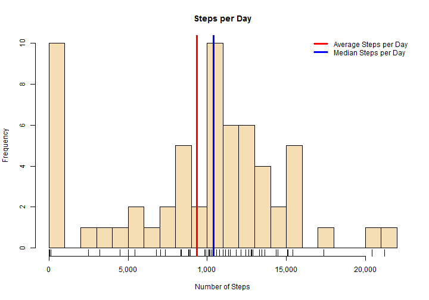
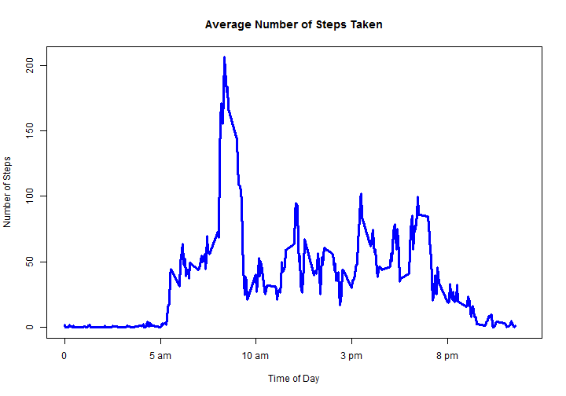
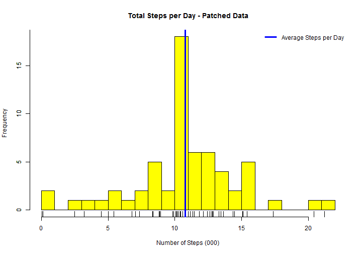
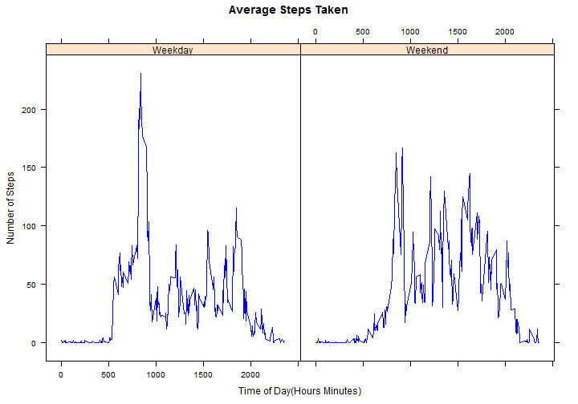

##  Loading and preprocessing the data

Data for this assignment is stored on line. The code below will create a new folder in your working directory, download zipped data file there, unzip the file, read its contents into your R workspace and preform initial data pre-processing.  


```r
# clear out workspace
rm(list = ls())

#load libraries
library(dplyr)
library(lattice)

# initialize and set working direcotry
#getwd()
setwd("~/Coursera Data Science/Reproducible Research")


urlzip <- "https://d396qusza40orc.cloudfront.net/repdata%2Fdata%2Factivity.zip"
zipfile <- "personal_movement.zip"

# create folder called 'Project1' in the working directory
if(!file.exists("./Project1")){dir.create("./Project1")} 

setwd("./Project1")
downfold <- getwd()

# download zip file
if(!file.exists(zipfile))
{download.file(urlzip, destfile=zipfile)}

# Record Date of file download 
downloaddate <- date()

# read file names inside zip file
file_ls <- as.character(unzip(zipfile, list = TRUE)$Name)

#create names for the data frames
#file_ls_name <- strsplit(file_ls, "\\.")

## check if unzipped files are present and unzip if necessary
for (unzf in file_ls){if (!file.exists(unzf)) {unzip(zipfile, unzf)}}


## Load unzipped files into you R workspace
for (i in seq_along(file_ls)) {
      nametmp <- (nametmp <- strsplit(file_ls[[i]], "\\."))[[1]][[1]]
      assign(nametmp, read.csv(file_ls[[i]], na.strings = "NA"))
}

rm(file_ls, i, nametmp, unzf, urlzip, zipfile)
setwd("../")

##  Format date
activity$date <- as.Date(activity$date)
```


Data downloaded on Sun Oct 18 14:20:53 2015 in C:/Users/Elena/Documents/Coursera Data Science/Reproducible Research/Project1 folder.

##  What is mean total number of steps taken per day?


```r
plot1data <- activity %>%
  group_by (date) %>%
  summarize(totalsteps = sum(steps, na.rm = TRUE),
            avgsteps = round(mean(steps, na.rm = TRUE)),
            mediansteps = median(steps, na.rm = TRUE))

aggplot1data <- plot1data %>%
  summarize(avgsteps = round(mean(totalsteps, na.rm = TRUE)),
            mediansteps = median(totalsteps, na.rm = TRUE))
```


```r
hist(plot1data$totalsteps, breaks = 20, col = "wheat", xaxt = "n",
     main = "Steps per Day",
     xlim = c(0, 22000),
     xlab = "Number of Steps")
rug(plot1data$totalsteps)
axis(side = 1, at = c(0, 5000, 10000, 15000, 20000),
     labels = c("0", "5,000", "1,000", "15,000", "20,000"))
abline(v = aggplot1data$avgsteps, lwd = 3, col = "red")
abline(v = aggplot1data$mediansteps, lwd = 3, col = "blue")
legend("topright", lwd = 3, col = c("red", "blue"), bty = "n",
       legend = c("Average Steps per Day", "Median Steps per Day"))
```

 


On average, 9,354 steps were taken every day with the median of 10,395. 


##  What is the average daily activity pattern?


```r
plot2data <- activity %>%
  group_by (interval) %>%
  summarize(totalsteps = sum(steps, na.rm = TRUE),
            avgsteps = round(mean(steps, na.rm = TRUE), 2),
            mediansteps = median(steps, na.rm = TRUE)) %>%
  arrange(interval)
```


```r
with(plot2data, plot(interval, avgsteps, type = 'l', lwd = 3, col = "blue",
                     main = "Average Number of Steps Taken",
                     xlim = c(0, 2400), xaxt = "n", 
                     xlab = "Time of Day",
                     ylab = "Number of Steps"))
axis(side = 1, at = c(0, 500, 1000, 1500, 2000),
               labels = c("0", "5 am", "10 am", "3 pm", "8 pm"))
```

 


```r
##Looking for interval with the maximum average number of steps
maxsteps <- max(plot2data$avgsteps)
##  max number of average steps
#maxsteps
maxpoint <- plot2data[(plot2data$avgsteps == maxsteps),]
maxinterval <- maxpoint[[1]]
## interval with max average steps begns at
#maxinterval
##  interval with max average steps end at
maxintervalend <- plot2data[[which (plot2data$interval == maxinterval) +1 , 1]]
#maxintervalend
```

On an average day maximum number of steps in a 5-minute interval was 206.  They were taken between 835 and 840 in the morning - commute time!


##  Imputing missing values


```r
##  total number of missing values
missed <- sum(is.na(activity$steps))
```

There are 2304 records with missing values in our original data set.  To fill in the gaps we'll use the average number of steps for each 5-minute interval  calculated over all vailable data. 


```r
##  all rows with missing values
misstep <- select(activity[which(is.na(activity$steps)),], interval, date)

##  all complete rows
allsteps <- activity[complete.cases(activity), ]
allsteps$source <- "actual"

##  create a patch for the mising dates
patchstep <- select(plot2data, interval, steps = round(avgsteps))
patchstep$source <- "average"
  
##  patch the originl data
mergedsteps <- merge(misstep, patchstep)
activitypatched <- arrange(rbind(allsteps, mergedsteps), date, interval)
```


```r
##  Recreate plot 1 with clean activity data
plot3data <- activitypatched %>%
  group_by (date) %>%
  summarize(totalsteps = sum(steps),
            avgsteps = round(mean(steps)),
            mediansteps = round(median(steps)))

aggplot3data <- plot3data %>%
  summarize(avgsteps = round(mean(totalsteps)),
            mediansteps = round(median(totalsteps)))
```


```r
hist(plot3data$totalsteps, breaks = 20, col = "yellow", xaxt = "n",
     main = "Total Steps per Day - Patched Data",
     xlab = "Number of Steps (000)")
rug(plot3data$totalsteps)
axis(side = 1, at = c(0, 5000, 10000, 15000, 20000),
     labels = c(0, 5, 10, 15, 20))
axis(side = 2, at = c(0, 5, 10, 15, 20))
abline(v = aggplot3data$avgsteps, lwd = 3, col = "blue")
#abline(v = aggplot3data$mediansteps, lwd = 3, col = "blue")
legend("topright", lwd = 3, col = c("blue"), bty = "n",
       legend = c("Average Steps per Day"))
```

 

Now the average number of daily steps stands at 10,766, with the median of 10,766.  These numbers are greater than the corresponding statistics from our initial data,  9,354 and 10,395 respectively.


##  Are there differences in acticity patterns between weekdays abd weekends?


```r
##  add weekday / weekend factor
activitypatched$dayofweek <- ifelse(weekdays(activitypatched$date) %in% 
                              c("Saturday", "Sunday"), "Weekend", "Weekday")
activitypatched <- transform(activitypatched, dayofweek = factor(dayofweek))

##  aggregate data for the plot
plot4data <- activitypatched %>%
  group_by (dayofweek, interval) %>%
  summarize(totalsteps = sum(steps, na.rm = TRUE),
            avgsteps = round(mean(steps, na.rm = TRUE), 2),
            mediansteps = median(steps, na.rm = TRUE))
```


```r
xyplot(avgsteps~interval | dayofweek, data = plot4data, type = "l",
       layout = c(2, 1), col = "blue",
       main = "Average Steps Taken",
       xlab = "Time of Day(Hours Minutes)",
       ylab = "Number of Steps"
       )
```

 

